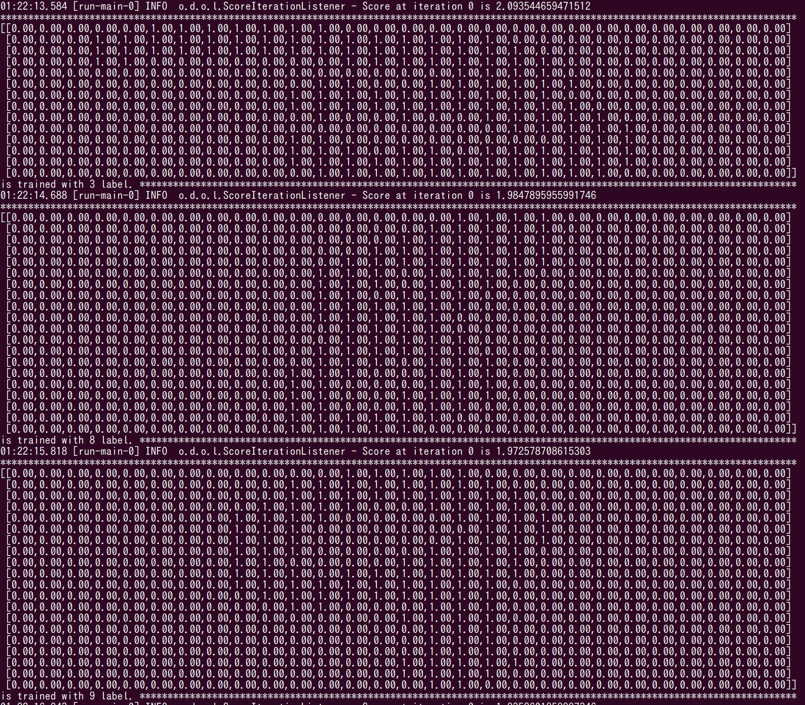

CNN Mnist Example with Pretty Print
=========================

DeepLearning4j MNIST example for DEMO in [ScalaMatsuri 2016](http://scalamatsuri.org/)

Added pretty printing of MNIST INDArray using [ND4S](https://github.com/deeplearning4j/nd4s) as shown at bottom.

Covolutional Neural Nets setting ports from [dl4j-spark-cdh5-examples](https://github.com/deeplearning4j/dl4j-spark-cdh5-examples/blob/85171de5516d53ace099a10fa1d9185fe1a16eb3/src/main/java/org/deeplearning4j/examples/cnn/MnistExample.java).

For more information, please check out [deeplearning4j.org](http://deeplearning4j.org/) and its [JavaDoc](http://deeplearning4j.org/doc/).

Other examples are here: [deeplearning4j/dl4j-0.4-examples - Java](https://github.com/deeplearning4j/dl4j-0.4-examples) or [kogecoo/dl4j-0.4-examples-scala: a simple scala porting of https://github.com/deeplearning4j/dl4j-0.4-examples](https://github.com/kogecoo/dl4j-0.4-examples-scala/)

If you notice issues, please log them, and if you want to contribute, submit a pull request. Input is welcome here.

## Performance (10000 samples)

| **Model Name**      | **Accuracy** | **F1** | **Training**  |
|---------------------|--------------|--------|---------------|
| CNNMnist            | 0.89         | 0.89   | batch         |

* Accuracy and F1 depends on how many examples the model is trained on.

